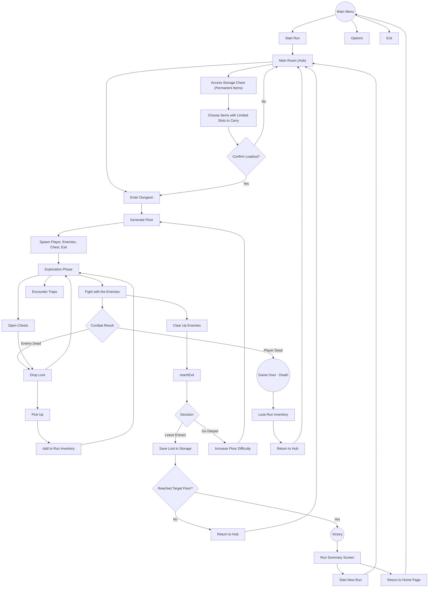

```mermaid
graph TD

%% =======================
%% HOME / HUB
%% =======================
start((Main Menu)) --> startRun[Start Run]
start --> options[Options]
start --> exit[Exit]

startRun --> hub["Main Room (Hub)"]
hub --> storage["Access Storage Chest (Permanent Items)"]
storage --> chooseItems[Choose Items with Limited Slots to Carry]
hub --> enterDungeon[Enter Dungeon]

%% =======================
%% LOADOUT
%% =======================
chooseItems --> confirmLoadout{Confirm Loadout?}

confirmLoadout -- No --> hub
confirmLoadout -- Yes --> enterDungeon

%% =======================
%% DUNGEON INITIALIZATION
%% =======================
enterDungeon --> initFloor[Generate Floor]
initFloor --> spawnEntities[Spawn Player, Enemies, Chest, Exit]
spawnEntities --> explore[Exploration Phase]

%% =======================
%% EXPLORATION LOOP
%% =======================
explore --> combat[Fight with the Enemies]
explore --> openChests[Open Chests]
explore --> encounterTrap[Encounter Traps]

%% =======================
%% COMBAT
%% =======================
combat --> checkCombat{Combat Result}
checkCombat -- Enemy Dead --> dropLoot[Drop Loot] --> explore
checkCombat -- Player Dead --> death((Game Over - Death))
openChests --> dropLoot

%% =======================
%% LOOT
%% =======================
dropLoot --> pickup[Pick Up] --> addInventory[Add to Run Inventory]
addInventory --> explore

%% =======================
%% EXIT DECISION
%% =======================
combat --> clearUpEnemies[Clear Up Enemies] --> reachExit --> decision{Decision}

decision -- Leave Extract --> extract[Save Loot to Storage]
decision -- Go Deeper --> nextFloor[Increase Floor Difficulty]

nextFloor --> initFloor

%% =======================
%% EXTRACTION
%% =======================
extract --> winCheck{Reached Target Floor?}

winCheck -- No --> returnHub[Return to Hub]
winCheck -- Yes --> win((Victory))

returnHub --> hub

%% =======================
%% DEATH / END
%% =======================
death --> loseLoot[Lose Run Inventory]
loseLoot --> returnHubAfterDeath[Return to Hub]
returnHubAfterDeath --> hub

%% =======================
%% END STATES
%% =======================
win --> summary[Run Summary Screen]
summary --> restart[Start New Run]
summary --> home[Return to Home Page]

restart --> hub
home --> start
```